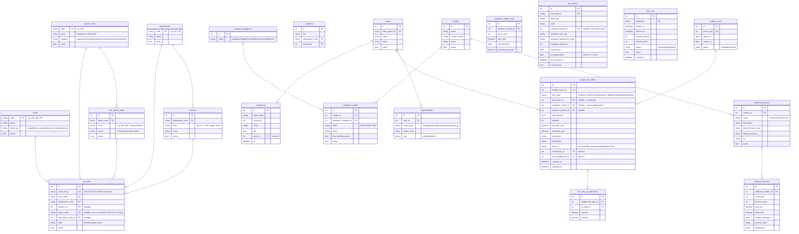

```mermaid
erDiagram
    %% ---- GL / Chart of Accounts ----
    funds ||--o{ gl_codes : ""
    departments ||--o{ divisions : ""
    departments ||--o{ gl_codes : ""
    divisions ||--o{ gl_codes : ""
    object_codes ||--o{ sub_object_codes : ""
    object_codes ||--o{ gl_codes : ""
    sub_object_codes ||--o{ gl_codes : ""

    funds { string code PK "e.g. 100, 200, 253"
            string name
            string fund_type "areawide|non_areawide|service_area|enterprise"
            bool active }

    departments { string code PK "e.g. 115, 150"
                  string name
                  bool active }

    divisions { int id PK
                string department_code FK
                string code "e.g. 117 - NOT unique alone"
                string name
                bool active }

    object_codes { string code PK "e.g. 434"
                   string name "Equipment under $24K"
                   string category "wages|travel|supplies|equipment|software|contractual|other"
                   bool active }

    sub_object_codes { int id PK
                       string object_code FK
                       string code "e.g. 100, 300 - can be 000/null"
                       string name "IT Equipment under $24K"
                       bool active }

    gl_codes { int id PK
               string code_string UK "100.115.117.434.000 (canonical)"
               string fund_code FK
               string department_code FK
               int division_id FK "nullable"
               string object_code FK "nullable - lets us represent 100.115.117 rollup"
               int sub_object_code_id FK "nullable"
               string label "friendly display name"
               bool active }

    %% ---- Local user mirror (Entra-backed identity) ----
    users { int id PK
            string entra_object_id UK
            string name
            string email
            bool active }

    %% ---- Responsibility mapping (director rollup vs division detail) ----
    users ||--o{ responsibilities : ""
    responsibilities { int id PK
                       int user_id FK
                       string scope_type "fund|department|division|object|specific_gl"
                       string scope_value
                       string role "view|edit|admin" }

    positions { int id PK
                string title
                string department_code FK
                int division_id FK }

    %% ---- Vendors / Products ----
    vendors { int id PK
              string name
              string contact_email
              string notes
              bool active }

    software_products ||--o{ software_licenses : ""
    vendors ||--o{ software_products : ""
    software_products { int id PK
                        int vendor_id FK
                        string name "1Password Teams Pro"
                        string description
                        string default_license_type
                        string billing_frequency
                        string url
                        bool active }

    software_licenses { int id PK
                        int software_product_id FK
                        int fiscal_year
                        int license_count
                        decimal unit_cost
                        decimal total_cost
                        date license_expiration
                        string license_notes
                        string justification }

    hardware_categories ||--o{ hardware_models : ""
    vendors ||--o{ hardware_models : ""
    hardware_categories { int id PK
                          string name "Laptop|Desktop|iPhone|iPad|Cradlepoint|Monitor|..." }

    hardware_models { int id PK
                      int vendor_id FK
                      int hardware_category_id FK
                      string name "Dell Latitude 7450"
                      string specs
                      bool has_docking_option
                      bool active }

    hardware_model_costs { int id PK
                           int hardware_model_id FK
                           int fiscal_year
                           decimal unit_cost
                           bool with_docking
                           decimal docking_upcharge }

    %% ---- Hardware assets (from TDX) ----
    tdx_assets { int id PK
                 string tdx_asset_id UK
                 string asset_tag
                 string serial
                 int hardware_model_id FK "nullable - best-effort match"
                 string assigned_user_upn
                 string assigned_department_code
                 int assigned_division_id
                 date acquired_at
                 date fy_replacement "which FY it's due"
                 datetime last_synced_at
                 json raw_payload }

    %% ---- TDX sync logging ----
    sync_runs { int id PK
                string integration "tdx"
                datetime started_at
                datetime finished_at
                int records_synced
                int records_failed
                string status "success|partial|failed"
                json errors
                datetime created_at }

    %% ---- The budget request itself ----
    budget_cycles { int id PK
                    int fiscal_year UK
                    date opens_at
                    date closes_at
                    string status "draft|open|closed" }

    budget_line_items ||--|{ line_item_gl_allocations : ""
    budget_cycles ||--o{ budget_line_items : ""
    users ||--o{ budget_line_items : ""
    budget_line_items { int id PK
                        int budget_cycle_id FK
                        string item_type "hardware_replacement|hardware_addition|software|network|other"
                        int tdx_asset_id FK "nullable - if replacing"
                        int hardware_model_id FK "nullable - chosen replacement"
                        int software_product_id FK "nullable"
                        bool with_docking
                        int quantity
                        decimal previous_cost
                        decimal proposed_cost
                        string description
                        string justification
                        string status "not_started|in_progress|complete|declined"
                        int created_by_id FK "users.id"
                        int last_modified_by_id FK "users.id"
                        datetime created_at
                        datetime updated_at }

    line_item_gl_allocations { int id PK
                               int budget_line_item_id FK
                               int gl_code_id FK
                               decimal percent
                               decimal amount }

    %% ---- Audit ----
    users ||--o{ activity_log : ""
    activity_log { int id PK
                   string table_name
                   int record_id
                   string action
                   json diff
                   int actor_id FK "users.id"
                   datetime at }
```
